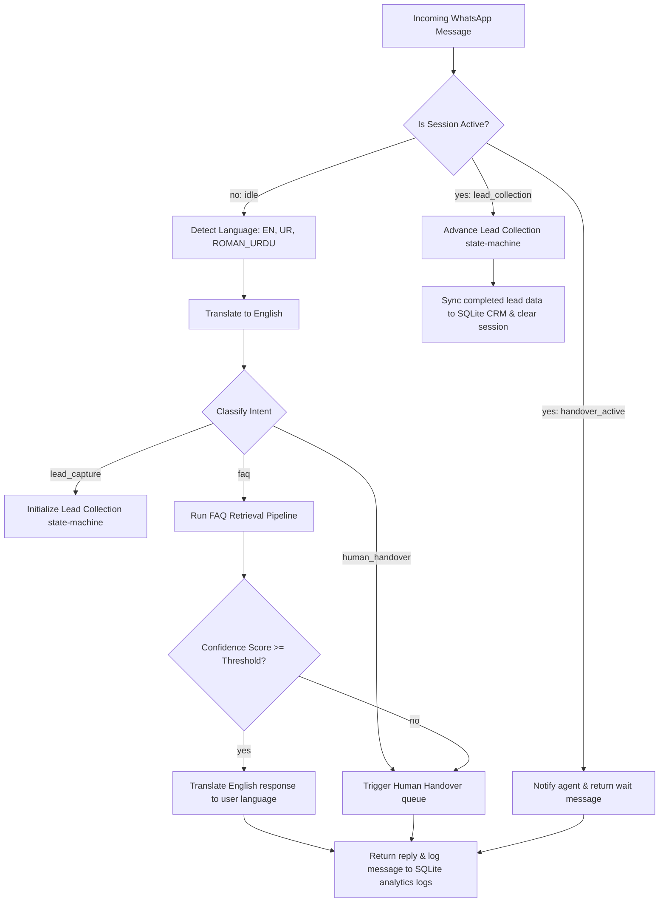

# 🚀 SafeX Auto-Reply Bot Suite

[](https://fastapi.tiangolo.com/)
[](https://www.python.org/)
[](https://www.trychroma.com/)
[](https://www.sqlite.org/)
[](https://llm7.io/)

An integrated, production-grade **WhatsApp Auto-Reply Bot Suite** built for **SafeX Solutions' customer support and lead generation**. 

This system integrates five key support modules into a single FastAPI backend:
1.  **🧠 FAQ Retrieval Engine**: Hybrid retrieval (ChromaDB vector search + BM25 keyword matching) with Reciprocal Rank Fusion (RRF), cross-encoder reranking, and a sigmoid-based confidence gate.
2.  **🌐 Multi-Language Processor**: Automatic detection of English, Urdu (Arabic script), and Roman Urdu (Latin script) using free LLM APIs, translating queries to English before retrieval, and responses back to the original language.
3.  **🧠 Automated Routing Engine**: Checks session states and classifies intents (`faq`, `lead_capture`, `human_handover`) to orchestrate conversational flows.
4.  **📋 Lead Collection Flow**: A 5-step interactive state-machine to capture prospective lead information (Name, Email, and Requirements) with regex format validation.
5.  **📞 Human Handover Logic**: Pauses automatic bot replies and escalates to a live-agent queue if the FAQ confidence score falls below the threshold or upon explicit user request.
6.  **🗃️ CRM Sync & SQLite Integration**: Persists captured leads to a local database (`data/safex_bot.db`) with automatic de-duplication (appending new project requests under existing contacts).
7.  **📊 Bot Analytics & Simulator Dashboard**: A beautiful, dark-mode glassmorphic web UI served at `/analytics/dashboard` displaying performance charts, live logs, handover ticket controls, and a fully interactive **WhatsApp Chat Simulator**.

---

## 🏗️ Integrated Bot Architecture



---

## 📂 Project Structure

```text
safex-faq-knowledge-base/
├── app/
│   ├── api/             # API Endpoints (FAQ, Bot Message, Handover, Analytics)
│   ├── core/            # Core Pipeline Logic
│   │   ├── analytics.py # Analytics logger & aggregator [NEW]
│   │   ├── cache.py     # Redis exact/near-match cacher
│   │   ├── confidence.py# Sigmoid confidence calculation
│   │   ├── crm.py       # SQLite CRM lead sync & de-duplication [NEW]
│   │   ├── db.py        # SQLite database connection & schema init [NEW]
│   │   ├── fusion.py    # Reciprocal Rank Fusion (RRF)
│   │   ├── handover.py  # Handover queue & ticket claiming [NEW]
│   │   ├── language.py  # Multi-language detection & translation using LLM7 [NEW]
│   │   ├── lead_collection.py # 5-step Lead collection state machine [NEW]
│   │   ├── pipeline.py  # Core FAQ retrieval pipeline (Search + RRF + Reranker)
│   │   ├── query_rewrite.py # Gemini query expansion
│   │   ├── router.py    # Main bot routing orchestrator [NEW]
│   │   └── session.py   # State tracking with Redis / Memory fallback [NEW]
│   ├── models/          # Request, response, and analytics database schemas
│   ├── services/        # Client Integrations
│   │   ├── gemini_client.py # Free OpenAI-compatible LLM7 Client wrapper [UPDATED]
│   │   ├── redis_client.py  # Redis cache client wrapper
│   │   └── whatsapp_client.py # Meta WhatsApp Cloud API request wrapper [NEW]
│   ├── templates/
│   │   └── dashboard.html # Glassmorphic Analytics Dashboard & Simulator [NEW]
│   ├── config.py        # Configurations loader (dot-env / SQLite paths)
│   └── main.py          # FastAPI application startup & DB lifecycle hook
├── data/
│   ├── chroma_db/       # Persistent Vector Database directory
│   ├── safex_bot.db     # SQLite CRM, handover, and log database [NEW]
│   └── safex_faq_dataset.json  # Curated FAQ dataset
├── docs/                # Architecture docs and progress reports
├── scripts/             # Data ingestion and metric evaluation scripts
└── tests/               # PyTest unit and integration tests
```

---

## 🚀 Installation & Local Setup

### 1. Prerequisites
Ensure you have **Python 3.9+** and a running instance of **Redis** (optional, caching is bypassed if Redis configuration is omitted).

### 2. Setup environment
```bash
# Create and activate virtual environment
python -m venv venv
source venv/bin/activate  # On Windows: venv\Scripts\activate

# Install dependencies
pip install -r requirements.txt
```

### 3. Environment Configuration
Create a `.env` file in the root directory. You can copy the template:
```bash
cp .env.example .env
```
Configure your credentials in `.env`:
```env
# LLM Client (llm7.io is free, you can use any API token or keep the default)
GEMINI_API_KEY="sk-llm7-free-access-token"
CONFIDENCE_THRESHOLD=0.70
SQLITE_DB_PATH="data/safex_bot.db"

# WhatsApp Integration Webhook Credentials (optional, for live testing)
WHATSAPP_CLOUD_API_TOKEN="your-meta-whatsapp-token"
WHATSAPP_PHONE_NUMBER_ID="your-phone-id"
WHATSAPP_VERIFY_TOKEN="safex_verify_token_123"
```

### 4. Ingest FAQ Data
Populate the ChromaDB database with the embedded FAQ dataset:
```bash
python scripts/ingest_data.py
```

### 5. Running the Application
Start the FastAPI local development server:
```bash
uvicorn app.main:app --reload
```
Open your browser and navigate to:
*   **Analytics Panel & WhatsApp Chat Simulator**: **[http://localhost:8000/analytics/dashboard](http://localhost:8000/analytics/dashboard)**
*   Interactive API Docs: **[http://localhost:8000/docs](http://localhost:8000/docs)**

---

## 🔌 API Reference

### 1. Bot Unified Message Endpoint
*   **Path**: `/bot/message`
*   **Method**: `POST`
*   **Request Body**:
    ```json
    {
      "sender": "+923001234567",
      "message": "website banani hai"
    }
    ```
*   **Response Body**:
    ```json
    {
      "sender": "+923001234567",
      "reply": "Hamara office Web development cover karta hai...",
      "intent": "faq",
      "language": "roman_urdu",
      "session_state": "idle"
    }
    ```

### 2. Handover Claims API
*   **GET `/handover/pending`**: List all users waiting for human assistance.
*   **POST `/handover/claim?handover_id=X&agent_name=AgentZain`**: Assign a pending escalation to an agent.
*   **POST `/handover/resolve?handover_id=X`**: Resolve a ticket and clear the session, letting the bot auto-respond again.

### 3. WhatsApp Cloud API Webhooks
*   **GET `/bot/whatsapp/webhook`**: Verifies Meta webhook subscription verification handshake.
*   **POST `/bot/whatsapp/webhook`**: Receives, parses, processes, and responds to real-time WhatsApp Cloud API user messages.

---

## 📊 Verification & Testing

### Automated Test Suite
Execute the integration and unit tests covering multilingual flows, lead captures, and handovers:
```bash
pytest
```
*(All mock models bypass external API dependencies to ensure clean, fast, offline execution).*
