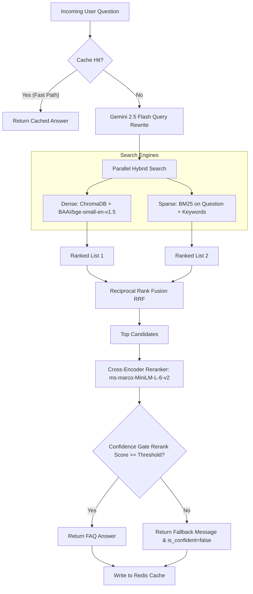

# 🚀 SafeX FAQ Knowledge Base

[](https://fastapi.tiangolo.com/)
[](https://www.python.org/)
[](https://www.trychroma.com/)
[](https://redis.io/)
[](https://deepmind.google/technologies/gemini/)

An advanced, production-grade **FAQ Retrieval Engine** built for **SafeX Solutions' WhatsApp Auto-Reply Bot** (Week 2, Group 10). This module utilizes a hybrid retrieval pipeline combining dense vector embeddings with sparse lexical search, merged via Reciprocal Rank Fusion (RRF), re-ranked by a Cross-Encoder, and protected by a confidence gate to ensure zero-hallucination auto-replies.

---

## 🏗️ Pipeline Architecture

This module implements a state-of-the-art retrieval pipeline to handle user messages effectively:



---

## 🌟 Key Features

*   **🧠 Gemini-Powered Query Rewriter**: Dynamically reformulates short, slang, or ambiguous user queries (e.g., "what's the price" $\rightarrow$ "What is the pricing model of SafeX Solutions?").
*   **🔍 Parallel Hybrid Search**: Fuses dense vector embeddings (**BAAI/bge-small-en-v1.5** via ChromaDB) and sparse lexical search (**BM25** on keywords/questions) to capture both semantic meaning and exact keyword matches.
*   **🔀 Reciprocal Rank Fusion (RRF)**: Merges dense and sparse lists cleanly without needing complex weight tuning.
*   **📈 Cross-Encoder Reranking**: Re-evaluates top retrieved candidates using **ms-marco-MiniLM-L-6-v2** to calculate accurate final similarity scores.
*   **🚪 Sigmoid-Based Confidence Gate**: Maps raw reranker scores to a probability scale ($0.0 - 1.0$). If it falls below a configurable threshold (e.g., `0.70`), the engine returns a graceful fallback message so that the bot can trigger **Human Handover** instead of sending an inaccurate answer.
*   **⚡ Redis caching**: Stores exact and near-exact query responses with customized TTLs to save costs and reduce latency.
*   **📊 Performance Evaluation**: Features a comprehensive evaluation script calculating core retrieval metrics: **Hit Rate@K**, **MRR**, and **NDCG@K**.

---

## 📂 Project Structure

```text
safex-faq-knowledge-base/
├── app/
│   ├── api/             # FastAPI Route definitions
│   ├── core/            # Pipeline Logic (retrieval, rewrite, fusion, rerank)
│   ├── models/          # Request and response schema definitions (Pydantic)
│   ├── services/        # Third-party integrations (WhatsApp, Redis, etc.)
│   ├── config.py        # Settings loader with Pydantic / dotenv
│   └── main.py          # FastAPI application entrypoint
├── data/
│   ├── chroma_db/       # Persistent ChromaDB storage directory
│   └── safex_faq_dataset.json  # Base FAQ Knowledge Base Dataset
├── docs/                # Architecture and progress reports
├── scripts/
│   ├── ingest_data.py   # Populates ChromaDB with dataset embeddings
│   └── evaluate_retrieval.py  # Runs metrics analysis on pipeline
└── tests/               # PyTest unit and integration tests
```

---

## 🚀 Getting Started & Local Setup

### 1. Prerequisites
Ensure you have **Python 3.9+** and a running instance of **Redis** (optional, caching is bypassed if Redis configuration is omitted).

### 2. Installation
Clone the repository and set up a virtual environment:
```bash
# Clone the repository
git clone https://github.com/your-username/safex-faq-knowledge-base.git
cd safex-faq-knowledge-base

# Create and activate virtual environment
python -m venv venv
source venv/bin/activate  # On Windows: venv\Scripts\activate

# Install dependencies
pip install -r requirements.txt
```

### 3. Environment Configuration
Create a `.env` file in the root directory. You can use the provided `.env.example` as a template:
```bash
cp .env.example .env
```
Open `.env` and configure your API keys:
```env
GEMINI_API_KEY="your-google-gemini-api-key"
CONFIDENCE_THRESHOLD=0.70
REDIS_URL="redis://localhost:6379"  # Leave empty if you don't want Redis caching locally
```

### 4. Data Ingestion
Populate the local ChromaDB database with the embedded FAQ dataset:
```bash
python scripts/ingest_data.py
```

### 5. Running the Application
Start the FastAPI server locally:
```bash
uvicorn app.main:app --reload
```
Once started, the interactive API documentation will be available at:
*   Swagger UI: **[http://localhost:8000/docs](http://localhost:8000/docs)**
*   ReDoc: **[http://localhost:8000/redoc](http://localhost:8000/redoc)**

---

## 🔌 API Reference

### Post Query Endpoint
*   **Path**: `/faq/query`
*   **Method**: `POST`
*   **Request Body**:
    ```json
    {
      "question": "Where is your office located?",
      "language": "en",
      "user_id": "+923001234567"
    }
    ```

*   **Response Body**:
    ```json
    {
      "answer": "Our office is at E-9, Islamabad, Pakistan. We're headquartered in Islamabad but serve clients in more than 15 countries worldwide.",
      "confidence": 0.98,
      "matched_faq_id": "CON004",
      "category": "contact",
      "is_confident": true,
      "cached": false,
      "candidates": [
        {
          "faq_id": "CON004",
          "question": "Where is SafeX Solutions located?",
          "answer": "Our office is at E-9, Islamabad, Pakistan...",
          "category": "contact",
          "score": 0.98
        }
      ]
    }
    ```

### Health Check Endpoint
*   **Path**: `/faq/health`
*   **Method**: `GET`
*   **Response**:
    ```json
    {
      "status": "ok",
      "faqs_loaded": 45,
      "chroma_ready": true,
      "bm25_ready": true
    }
    ```

---

## 📊 Verification & Testing

### Running Tests
Execute the unit and integration test suite to verify the application functionality:
```bash
pytest
```

### Running Retrieval Evaluation
Assess the accuracy of the retrieval pipeline against the curated test dataset:
```bash
python scripts/evaluate_retrieval.py
```
